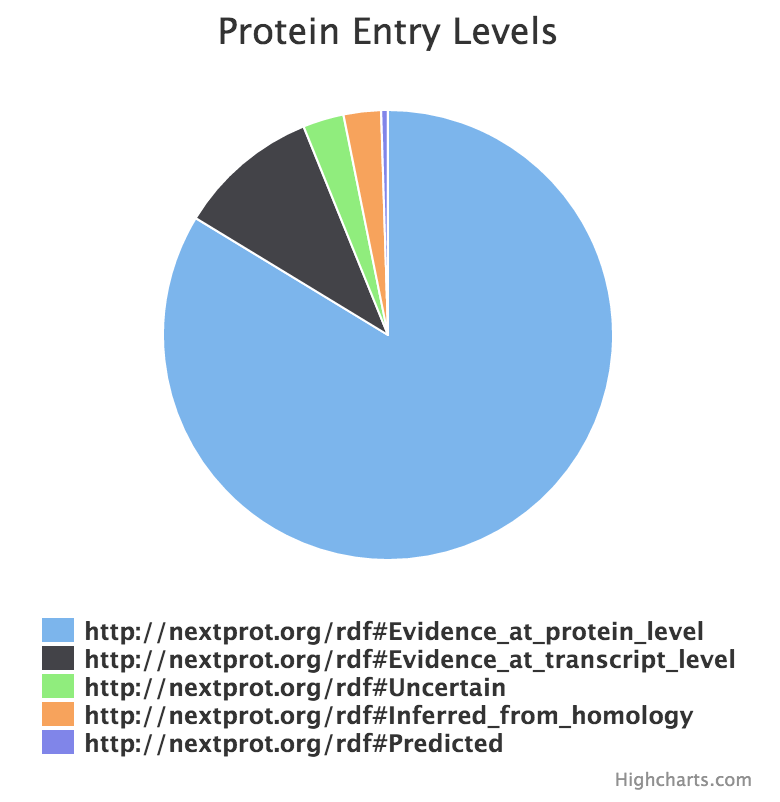

# neXtProt - The knowledge resource on human proteins

This is a code repository for the SIB - Swiss Institute of Bioinformatics CALIPHO group neXtProt project

See: https://www.nextprot.org/

# nextprot-js

A Javascript SDK that speaks with the neXtProt API (https://api.nextprot.org) and SPARQL endpoint. These resources are freely available and can be used by anyone to create awesome apps.

[](https://travis-ci.org/calipho-sib/nextprot-js)


Either you are an expert or a novice go ahead and try out the javascript library and don't hesitate to ask us questions if you have some troubles. We will appreciate your feedback.

In this [example](https://search.nextprot.org/entry/NX_P01308/view/peptides) you can see what we can achieve with this library.

## Installation 

Include nextprot script (specify the version and use CDN)

Without external dependencies :
```javascript
<script src="https://cdn.rawgit.com/calipho-sib/nextprot-js/v0.0.54/dist/nextprot.min.js"></script>
```
With external dependencies (jQuery, Handlebars, Promises ) :
```javascript
<script src="https://cdn.rawgit.com/calipho-sib/nextprot-js/v0.0.54/dist/nextprot.bundle.js"></script>
```
If you are in a bower environment
```
bower install nextprot
```

## Usage
Create the nextprot client giving some info about your application and who you are.
This information is not compulsary and you do not need to register, but it helps us maintain a good quality of the service.
```javascript
<script type="text/javascript">

 var applicationName = 'demo app'; //please provide a name for your application
 var clientInfo='calipho group at sib'; //please provide some information about you
 var nx = new Nextprot.Client(applicationName, clientInfo);

</script>
```

### Request API data

Request the protein part of interest (see the list of methods in here: https://api.nextprot.org)
Example to access the sequence
```javascript
nx.getProteinSequence('NX_P01308').then(function (isoforms){
    console.log(isoforms[0].sequence);
});
```

Example to access the overview of a protein
```javascript

nx.getProteinOverview('NX_P01308').then(function(overview) {
 console.log(JSON.stringify(overview, null, 2)); //pretty-prints the overview
});

```
### Execute SPARQL queries 

This SPARQL groups proteins by their existence level.

```javascript
 var query = 'SELECT ?pe count(?entry) as ?cnt ' +
      'WHERE {?entry :existence ?pe} group by ?pe order by desc(?cnt)';

  //Execute the sparql and print result
  nx.executeSparql(query).then(function (response) {
      console.log(JSON.stringify(response, null, 2)); //pretty-prints the response
      response.results.bindings.forEach(function (data) {
          var pe = data.pe.value.replace("http://nextprot.org/rdf#" , "");
          var cnt = parseInt(data.cnt.value);
          console.log(pe, ": ", cnt);
      });
  });
  
```

## Combine with external libraries

If combined with a chart library, you can create great charts without  much effort.
For example use [Highcharts](http://www.highcharts.com/demo):

```html
<head>
<script src="https://cdn.rawgit.com/calipho-sib/nextprot-js/v0.0.54/dist/nextprot.bundle.js"></script>
<script src="http://code.highcharts.com/highcharts.js"></script>
</head>
```
Create a div where you will plot the chart:
```html
<body>
 <div id="container" style="min-width: 310px; height: 400px; margin: 0 auto"></div>
</body>
```
and finally use the example of SPARQL queries to draw a chart:
```javascript
<script type="text/javascript">
    var nx = new Nextprot.Client('demo app', 'calipho group');
    var query ='SELECT ?pe count(?entry) as ?cnt ' + 
                                  'WHERE {?entry :existence ?pe} ' + 
                                  'group by ?pe order by desc(?cnt)';
   
     //Execute the sparql and print result
  nx.executeSparql(query).then(function (response) {
      var seriesData = [];
      response.results.bindings.forEach(function (data) {
          var pe = data.pe.value.replace("http://nextprot.org/rdf#" , "");
          var cnt = parseInt(data.cnt.value);
          seriesData.push({name : pe, y: cnt});
      });
      
      //Draw the plot
      $('#container').highcharts({
          chart: { type: 'pie'},
          title: { text: 'Protein Entry Levels'},
          plotOptions: { pie: { dataLabels: {enabled: false}, showInLegend: true }},
          series: [{name: 'neXtProt entries count',data: seriesData }]
      });
  });
  
</script>
```

And voila you should get a fancy pie chart representing the different protein existence levels:

 <a href="https://search.nextprot.org/entry/NX_P24298/gh/ddtxra/protein-existence-levels">
  
 </a>

See the full source code here: https://github.com/ddtxra/protein-existence-levels/blob/gh-pages/index.html

See a running example: https://search.nextprot.org/entry/NX_P24298/gh/ddtxra/protein-existence-levels

## Development

* grunt - concat and creates a bundle
* grunt serve - runs app on web server


## Deployment 

* grunt prod - creates minified and bundled versions in dist folder
* npm test - runs the tests before releasing ! (test runs against production version)
another way to run tests is to do grunt serve and access http://localhost:5000/test

* grunt bump - On master branch only. tags the repository (don't forget to push). The tag is used by bower
* npm publish
