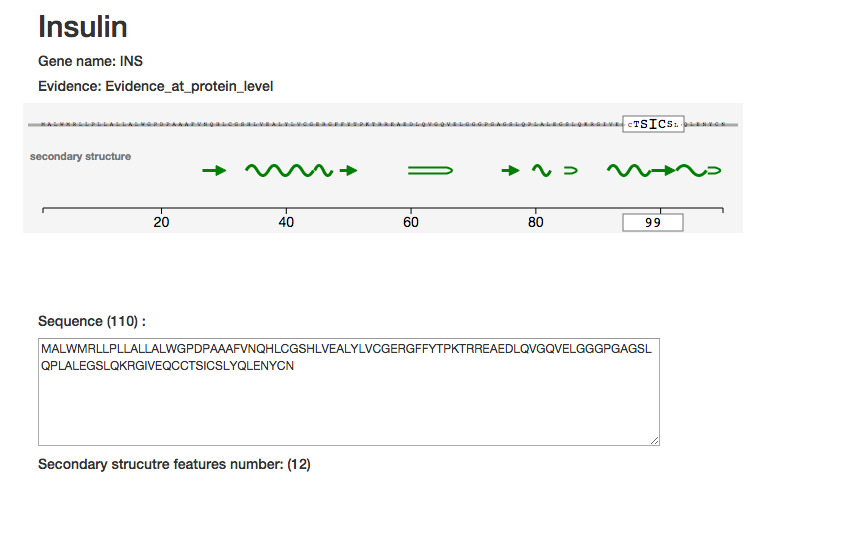

A javascript library that communicates directly with the nextprot (www.nextprot.org) REST api (https://api.nextprot.org). The api is freely available and can be used by anyone to create awsome apps :)
Either you are an expert or a novice go ahead and try out the javascript library and don't hesitate to ask us questions if you have some troubles. We will appreciate your feedback.




##Installation 
```
bower install nextprot
```
or include the nextprot script

##Usage
Create the client and access the information you need (see the list of methods in here: https://api.nextprot.org)

Example to access the sequence
```
 var Nextprot = window.Nextprot;
  var nx = new Nextprot.Client();

 nx.getProteinSequence('NX_P01308').then(function (sequence){
 console.log(sequence);
 }
```

Example to access the overview of a protein
```
 var Nextprot = window.Nextprot;
  var nx = new Nextprot.Client();

  nx.getProteinOverview('NX_P01308').then(function(overview) {
    $("#entryName").text(overview.proteinNames[0].synonymName);
    $("#geneName").text(overview.geneNames[0].synonymName);
    $("#proteinEvidence").text(overview.history.proteinExistence);
  });

```

Some running examples: 
  * http://calipho-sib.github.io/nextprot-js/demo/secondary-structure.html?nxentry=NX_P01308
  * http://calipho-sib.github.io/nextprot-js/demo/overview?nxentry=NX_P01308
